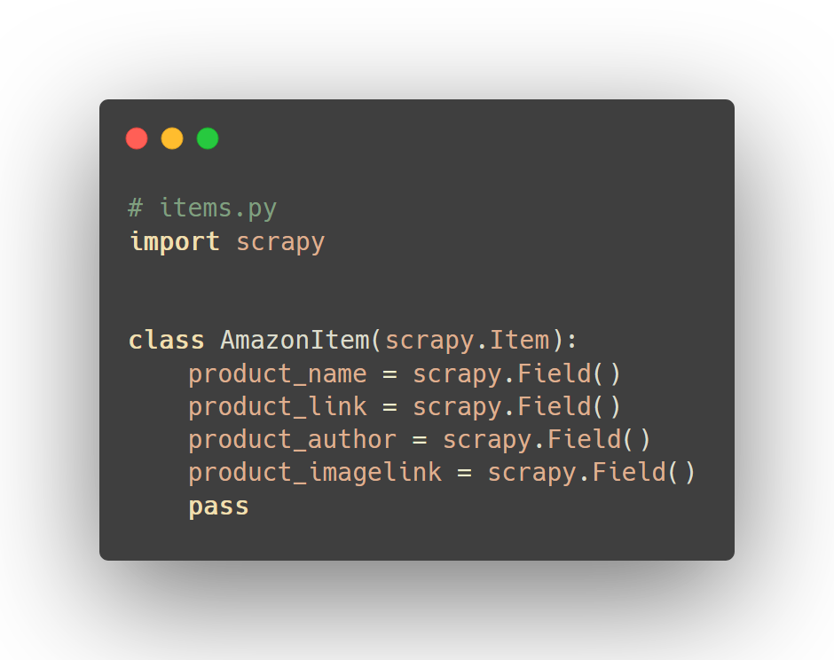
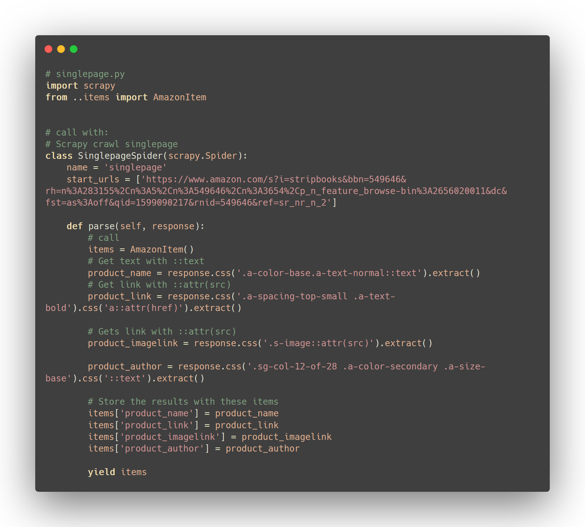
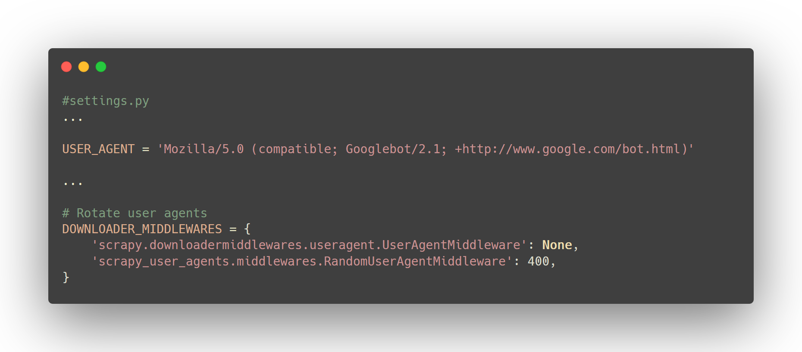
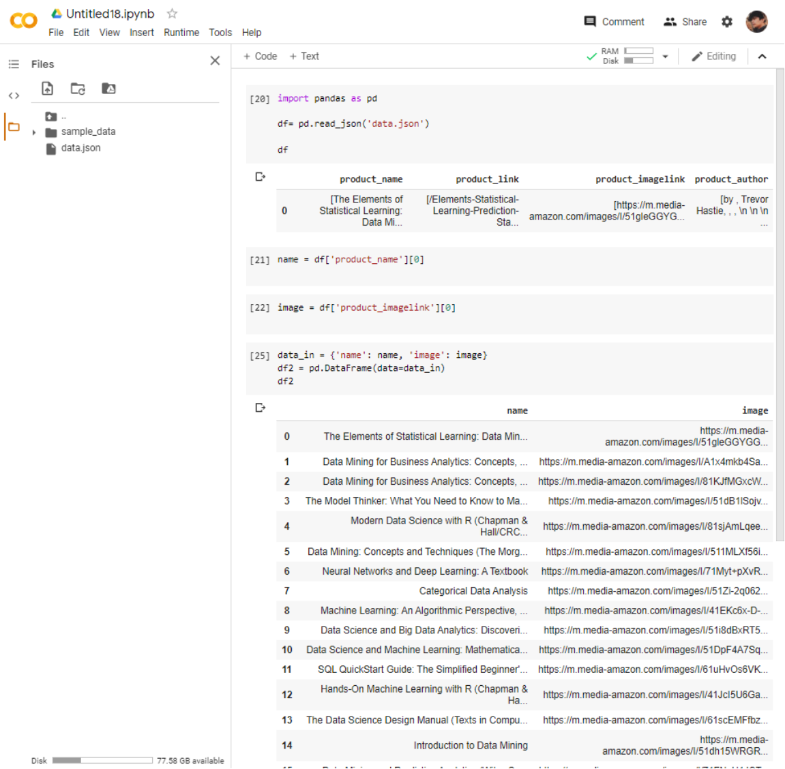

# quick-amazon-scrapy
A quick reference to start new scrapy projects

install scrapy

    pip install scrapy

start project

    scrapy startproject amazon
    cd amazon

Create a general spider

    scrapy genspider singlepage https://www.amazon.com/
    cd spiders
    
use use https://selectorgadget.com/ to select css classes
please note that amazon's front end is always changing and this
might be different in the future.

## items.py

## singlepage.py

Install scrapy user agents

    pip install scrapy-user-agents

## settings.py

Then we can run the program and export it as a json

    scrapy crawl singlepage -o data.json
    
## data cleaning

